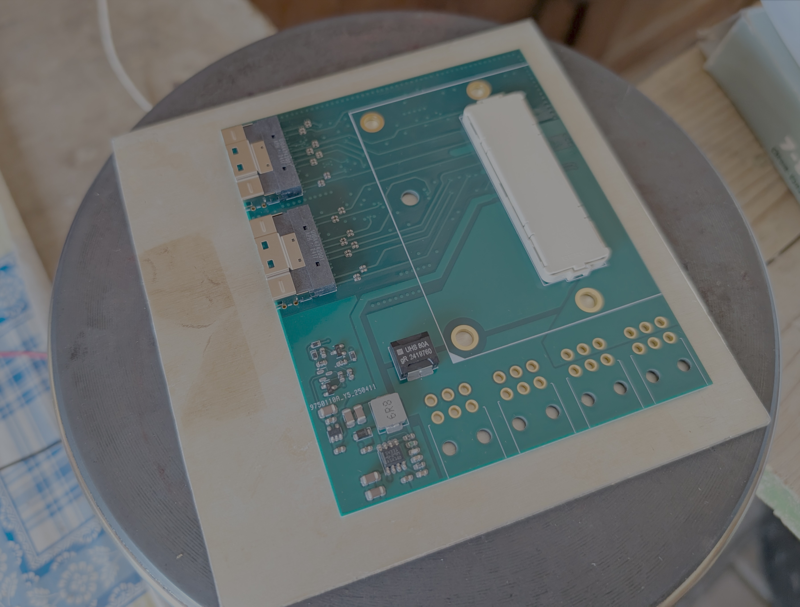
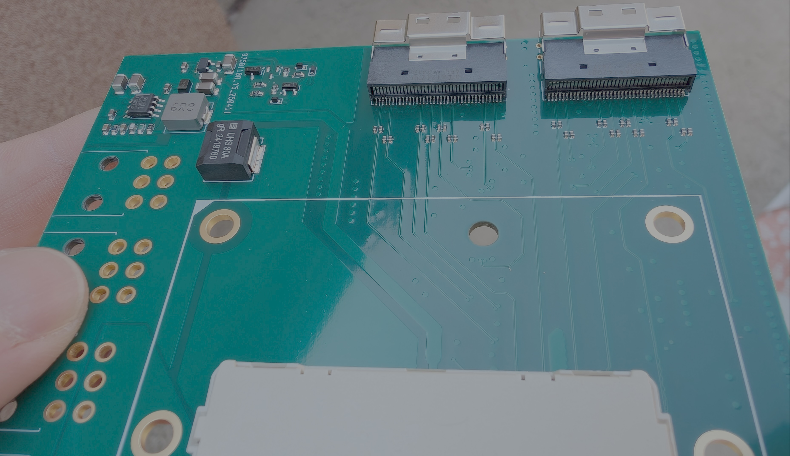
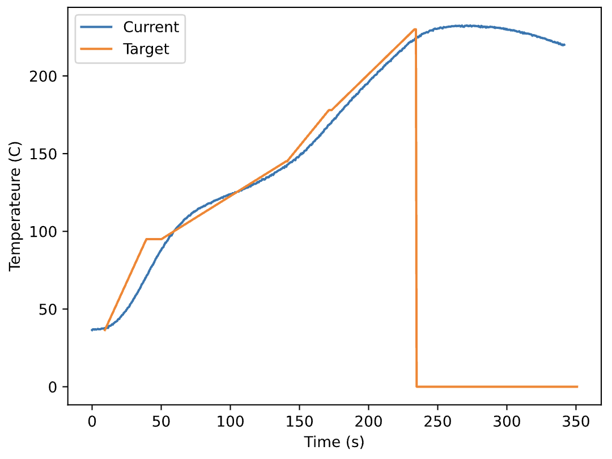
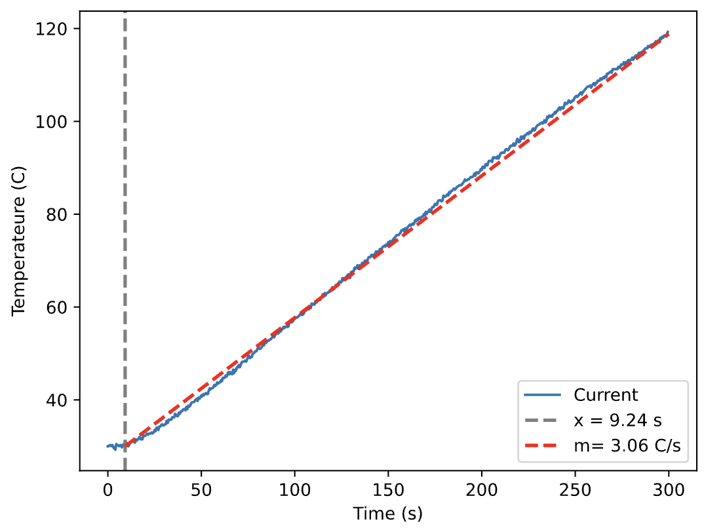

# Quick and dirty reflow hotplate

Quick and dirty hotplate made from the heating element of an (~50 year) old electric stove. Should be easy to adapt to any build. The element itself is built in a big iron plate (it's not the US version where the heater is just coiled up. I don't think that would work).

It produces factory quality soldering with ChipQuick TS391AX10 paste (the image below has a BGA connector and pins under the side connectors):

Needed parts: ESP32 (only the PWM is ESP32 specific, should work with most other MCUs), MAX6675 K-type thermocouple amplifier, a K-type thermocouple, and a solid state relay, and a flat aluminium or copper plate for better heat distribution (optional). For the wiring, check `PWM_PIN`, `thermoCLK`, `thermoCS` and `thermoDO` in `src/main.cpp`.

My particular heating element is 2kW. Place the thermocouple in a good contact with the plate. My particular one is plugged in a hole in the mental plate in the place of a removed screw and glued in place with kapton tape. I use a SSR-40DA solid state relay.

# How does it work?

First it identifies the delay and gain of the system. Then, it uses a predictive model to predict the future temperature of the plate based on the past contol inputs, in order to compensate for the delay of the system. It uses a PI controller to control this future temperature.

# How to use?

Set `tuning=true` in `src/main.cpp` and upload it to the board. The plate should be at room temperature. The system will start the parameter estimation, which should take 5 minutes. At the end, it will print out the parameters `L` and `M`. Copy these two parameters to the corresponding variables in `src/main.cpp`, set `tuning=false`, and run the code. The plate should be <50℃ before staring in order to obtain the best results. 

If you want to modify the thermal profile, edit variable `thermalProfile` in `main.cpp`. The first value is the target end temperature in 50℃, and the second is the time to achieve it in seconds. The current profile is for ChipQuick TS391AX10. Check the temperature log on the serial port. The job finished when it reaches stage equal to the length of the profile (with the current profile, stage 4. Each element in the profile curve is a stage). Leave the PCB on the board for another 60-90s and remove it carfeully to cool down. You can copy the logs to `log.txt` and run `plot_log.py` to see how well the system respect the thermal profile.

If you experinece some issue with the parameter fitting, you can copy the log output of the tuning to `tuning_log.txt` and run `plot_tuning_log.py`, which should do the same fitting and print out the same `L` and `M` parameters (in fact I used this for development, this is verified to work). It will also produce a plot of the fit in `log_tune.pdf`:

